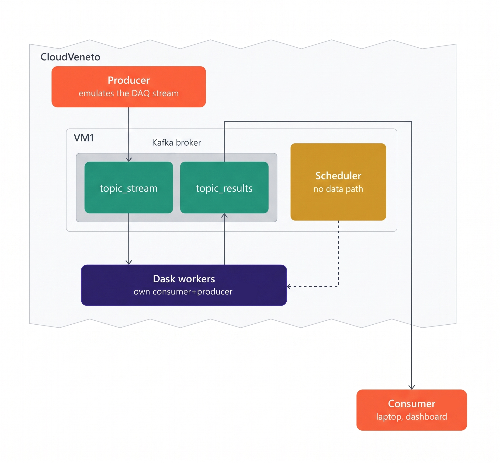

# Streaming processing of the QUAX experiment data with Dask and Kafka

## Overview

In this project, we build a **real time ETL (Extract-Transform-Load) pipeline for streaming data** produced by the DAQ of the **QUAX experiment**, a resonant RF cavity used in axion dark matter searches. The DAQ produces scans consisting of the In-phase (I) and Quadrature (Q) components, which are two sinusoid functions in quadrature phase and together form a complex-valued time-domain signal (I + jQ). Processing this raw data consists of performing a **Fourier transform** on each scan to move from the time domain to the frequency domain, and then averaging all scans within a data-taking run to obtain a single averaged power spectrum. Each scan contains $2^{11} = 2048$ samples, and the FFT uses the same number of bins, while spanning a $2$ MHz bandwidth.

The dataset is composed of 2 sets of .dat binary files, one for the I measures and the other for the Q, each one comprised of a continuous series of ADC readings from the amplifier. Each ADC reading is written in the raw files as a 32-bit floating point value in little-endian format. Each file contains $2^{23}$ samples and its size is 32 MB. A realistic data production has a **throughput of 16 MB/s** and produces 1 file-pair every about 5 seconds. 

## Architecture

The overall pipeline exploits **Dask** and **Apache Kafka** to perform the full real-time analysis. It consists of four main blocks:
- **Producer**: reads the raw I/Q `.dat` files and emulates a continuous DAQ stream, publishing batches of samples to Kafka topic `topic_stream` with a configurable number of samples per batch and a configurable target throughput. It is hosted in a CloudVeneto virtual machine (VM) for reasons that will be explained later, but can also be hosted on a laptop.
- **Dask cluster**: consumes the raw batches from `topic_stream`, performs the FFT-based processing, and publishes the resulting power spectra to `topic_results`. It is deployed in CloudVeneto, and it hosts 1 scheduler node and up to 4 worker nodes.
- **Kafka broker**: acts as the decoupling layer between data management and processing, buffering the raw stream on `topic_stream` and the processed results on `topic_results`. It is hosted in the same CloudVeneto VM where the Dask scheduler sits.
- **Consumer**: subscribes to `topic_results` and renders a live-updating dashboard, showing both the per-worker spectra and the cumulative averaged spectrum. It is hosted on a local laptop.

Kafka sits between the Producer and the Dask cluster, and again between the Dask cluster and the Consumer, so that each stage can run independently and at its own pace: a slowdown in processing does not block data ingestion, and a slowdown in visualization does not block processing. This decoupling also makes the pipeline horizontally scalable, since Dask workers can be added to increase processing throughput without changing the Producer or Consumer.

We set up Kafka `topic_stream` with a partition number equals to or larger than the number of workers. Indeed, **each worker hosts a Kafka consumer and a Kafka producer**, and we bypass the data streaming through the Dask scheduler which can be a potential bottleneck. This set up also allows the creation of a consumer group of worker nodes that process data in parallel, favouring the construction of an easy scalable system.

The communications between our laptops and the VMs in CloudVeneto are hold via an ssh tunnel. We rely on port forwarding, which allows to connect our laptops with CloudVeneto VMs that are not directly exposed to the internet. All client interactions with the Kafka cluster were implemented in our Python scripts using the kafka-python API (version 3.0.8).

Each CloudVeneto VM has 2 vCPUs and 4GB of RAM (*flavor: cloudveneto-medium*, OS: Debian 13).

